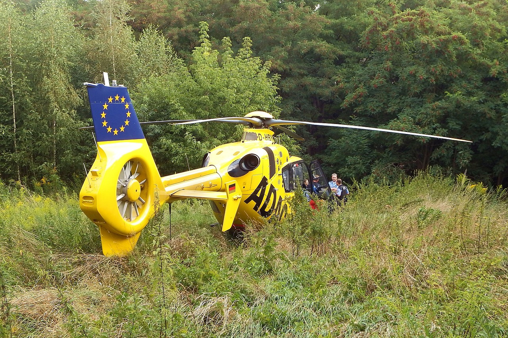

<h1 align="center">Helicopter Landing Sites Identification in Earth Engine</h1>

Earth Engine code for performing Helicopter Landing Zone Analysis in remote wild areas. It is a simple go/no-go solution using the intersection of vegetation, slope, and surface area.

## References

1. J. Berry, “Assessing Wildfire Response (Part 1): Oneth by Land, Twoeth by Air,” GeoWorld, pp. 10–11, Aug. 2011. [Online]. Available: https://read.dmtmag.com/i/41362-geoworld-august-2011/9
2. B. Miller, “An Automated, Multi-Criteria, Weighted Overlay Approach to Helicopter Landing Zones,” presented at the Esri International User Conference Paper Sessions, 2013.
3. “ESA WorldCover 10m v100,” Earth Engine Data Catalog. Available: https://developers.google.com/earth-engine/datasets/catalog/ESA_WorldCover_v100
